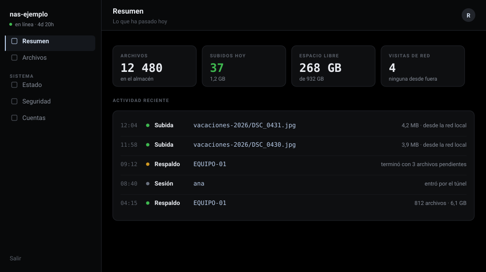
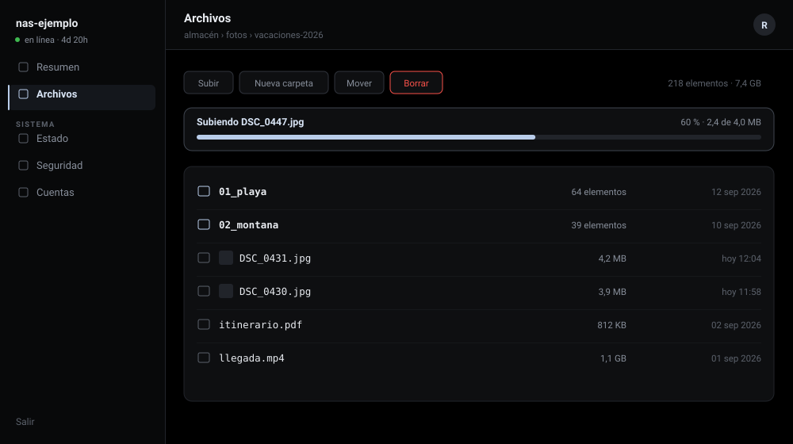
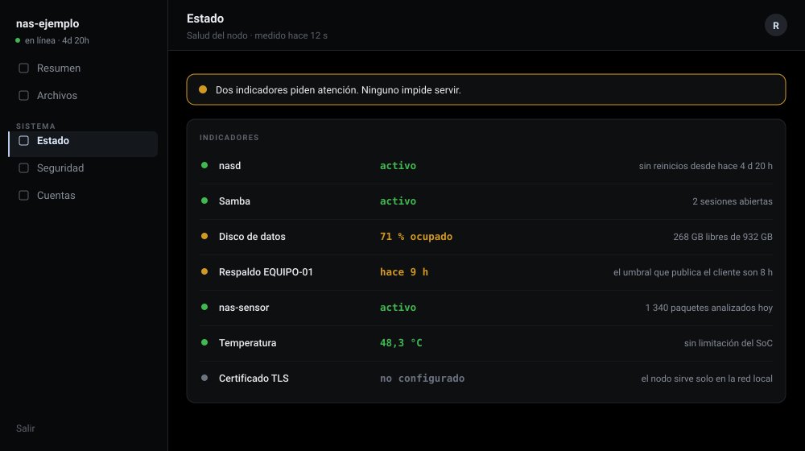
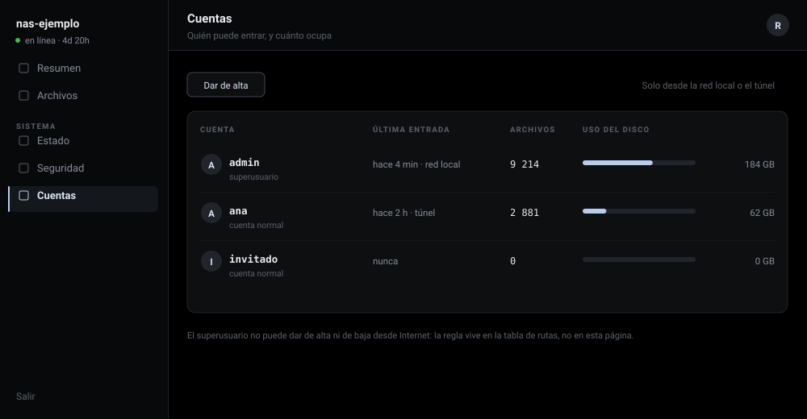

[🇬🇧 English](INTERFACE.md) · 🇪🇸 Español · [← Volver](README.es.md)

# La interfaz

Los cinco módulos del panel. Las imágenes son maquetas con datos inventados,
no capturas de ningún nodo: cada una enseña un caso distinto, que es lo que una
captura no puede hacer.

## Resumen

Lo ocurrido en el día, con el detalle de cada movimiento y desde qué red llegó.

## Archivos

El almacén. Aquí con una subida en curso, que es el estado que casi nunca
aparece en una captura.

## Estado

La salud del nodo. Dos indicadores en ámbar: el disco al 71 % y un respaldo más
viejo que el umbral que publica el propio cliente.

## Seguridad

Quién ha llamado y desde dónde, sobre el mismo mapa que sirve el nodo —174
países, generado fuera de línea y embebido en el binario—. Arriba, la cinta en
vivo alimentada por el flujo que ya existe. Abajo, el desglose por red y las
direcciones en cuarentena, que caducan solas.

## Cuentas

Quién puede entrar y cuánto ocupa. Dar de alta y de baja solo se puede desde la
red local o el túnel: la regla vive en la tabla de rutas, no en esta página.

