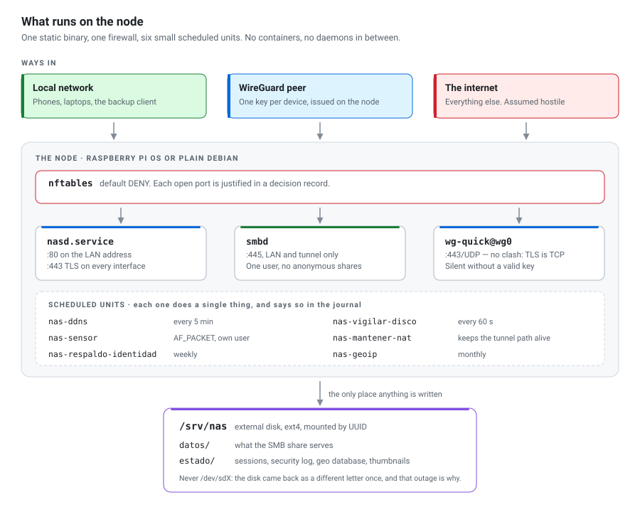
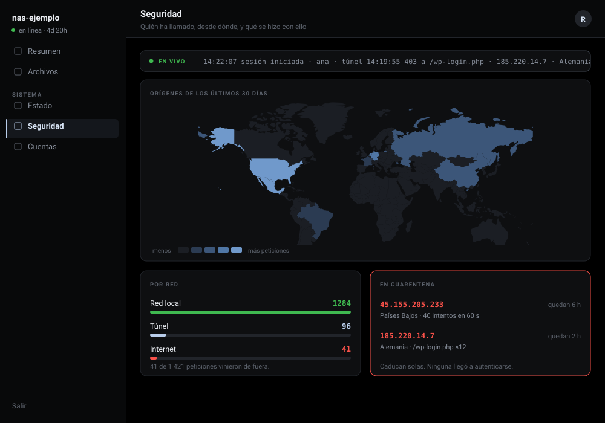
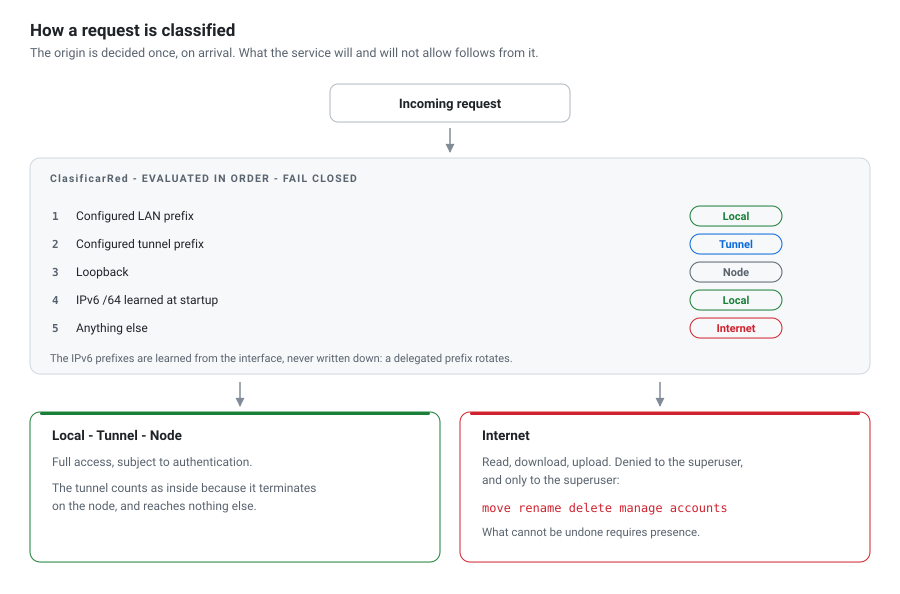
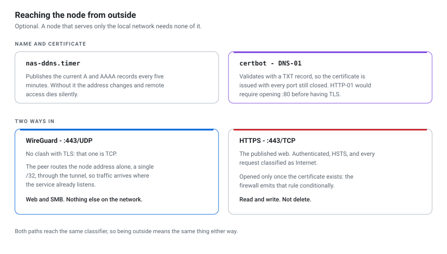

🇬🇧 English · [🇪🇸 Español](README.es.md)

# nasd — a self-hosted NAS, written from scratch

A file server for a single-board Linux node. It serves one store over two
paths — SMB and its own web interface — with an access-control and monitoring
panel on top. About 48,000 lines of Go with **no external dependencies**, two C
helpers, and a Windows backup client in PowerShell.

In production since July 2026.

<picture>
  <source media="(prefers-color-scheme: dark)" srcset="imagenes/nodo-dark.svg">
  
</picture>

<!-- The diagrams are emitted by 40_PUBLICACION/generar_imagenes.py in both
     variants. Do not edit them by hand: edit the generator and re-run it. -->

## Components

| Path | Role |
|---|---|
| `10_CODIGO/cmd/nasd` | The service: HTTP/HTTPS server, sessions, store, alerting |
| `10_CODIGO/internal/seguridad` | Access control: origin classification, quarantine, rate limits, rejection ring |
| `10_CODIGO/internal/geoip` | Country and network lookup from a binary database the service builds from a public TSV: no account, no API key |
| `10_CODIGO/internal/aviso` | Alerting: turns state changes into messages, with deduplication and severity |
| `10_CODIGO/nas-miniatura` | C helper that extracts the embedded EXIF thumbnail from a JPEG **without decoding the image** |
| `10_CODIGO/nas-sensor` | Packet sensor in C (`AF_PACKET`); its analysis half runs under sanitizers off the node |
| `20_APROVISIONAMIENTO` | 22 shell scripts that take a clean OS install to a working node |
| `30_CLIENTE_RESPALDO` | Windows backup client: scheduled runs, cold-disk copy, anti-ransomware sentinels, tray indicator |

## The interface



The security panel, over the same map the node serves. The interface is in
Spanish, as the product is. The other four modules are in
[**The interface**](INTERFACE.md).

## Access control

<picture>
  <source media="(prefers-color-scheme: dark)" srcset="imagenes/clasificacion-dark.svg">
  
</picture>

Classification is fail-closed: an unrecognised address is treated as external,
never as internal. Operations that cannot be undone — move, rename, delete,
account administration — are refused to the superuser over the internet, in the
route table rather than in the interface, so the page never offers a control
the server will reject.

## Remote access

<picture>
  <source media="(prefers-color-scheme: dark)" srcset="imagenes/acceso-remoto-dark.svg">
  
</picture>

Both paths are optional and off until configured. The firewall emits the TLS
rule only when a certificate exists, so a port is never open with nothing
behind it.

## Build and test

`go.mod` has no `require` block. TLS, the web layer, templating, the GeoIP
database, the panel's world map and the metrics are built in-tree or generated
offline and embedded with `go:embed`. Nothing is fetched at runtime, which
matters on a node whose purpose is to keep working on the local network when
the internet is down.

686 Go tests, a C corpus under the address and undefined-behaviour sanitizers,
and 333 PowerShell tests. The gate is `make verificar`: formatting, `go vet`,
the full suite, and `staticcheck` **compiled for linux/arm64**, the platform
the node runs, because some diagnostics exist only there. There is no CI: the
gate sits on the daily path.

## Installation

Six parameters and one command per machine.

On the node, over a clean Raspberry Pi OS or Debian install:

```sh
git clone <this repository> && cd nasd/20_APROVISIONAMIENTO
sudo install -d -m 0755 /etc/nas
sudo cp ajustes.conf.ejemplo /etc/nas/ajustes.conf
sudo nano /etc/nas/ajustes.conf
sudo ./instalar.sh
```

On the Windows workstation, for the backup client:

```powershell
cd 30_CLIENTE_RESPALDO
.\Instalar.ps1 -Nodo 192.168.1.38
```

`instalar.sh` invokes the 22 scripts in order and stops the moment one fails.
Before modifying the node it verifies every condition that would otherwise fail
midway — leaving the disk formatted and the service half installed — and
reports all of them at once. Details in
[`20_APROVISIONAMIENTO/LEEME.md`](20_APROVISIONAMIENTO/LEEME.md) and
[`10_CODIGO/LEEME.md`](10_CODIGO/LEEME.md).

## Configuration

Six parameters in `/etc/nas/ajustes.conf`: local network, node address,
interface, data disk, disk model and tunnel range. None are hardcoded.

They are declared, not detected. Inferring the network from the interface is
correct almost every time, and the exception — a second interface, an active
Wi-Fi link, an unsettled DHCP lease — yields an inference that is plausible and
wrong, which is the failure mode this design avoids: nothing breaks, and all
local traffic is classified as external. The service derives its local network
from the address it binds to, so the default matches the deployment.

## Design records

The code cites decisions — `ADR-0044`, `RF-30`, `§7`, and roughly 1,600 more —
that resolve to a design archive kept **private**: a project charter,
requirements, and 96 architecture decision records stating what was chosen and
what was rejected.

They are not published: they describe one specific deployment in operational
detail. The code carries a high comment density and most decisions are narrated
in the file where they apply, so the citations are largely redundant with the
text beside them. They still will not resolve to anything you can open, and
omitting that would be worse than declaring it.

## Requirements

- A Raspberry Pi 3B+ or better, running Raspberry Pi OS or Debian, and an
  external disk
- **Go 1.25.** If the node has it, the installer builds there; otherwise it
  stops and prints the exact command to build elsewhere and `scp` the result. A
  3B+ with 512 MB falls in the second case, as expected
- `zig cc`, **only** for the two C helpers, which are optional

## License

**All rights reserved. No license is granted.**

This repository is published to be read, not reused. The absence of a license
file is a decision, not an oversight.

### Third-party material

The web interface embeds two typefaces, **Archivo** and **DM Mono**, as
`.woff2` subsets under `internal/adaptadores/web/estatico/`. They are not mine
and the line above does not cover them: they come from Google Fonts under the
**SIL Open Font License 1.1**, which governs their use, and their copyright
belongs to their authors.
